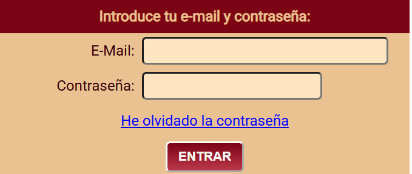
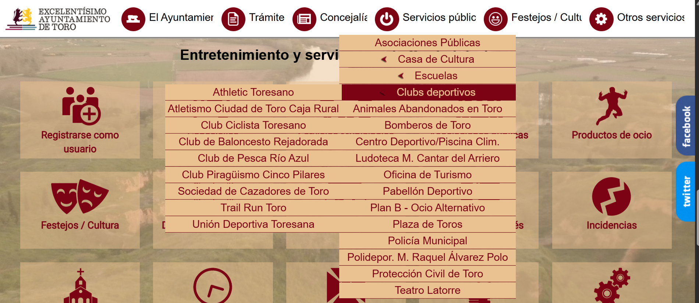
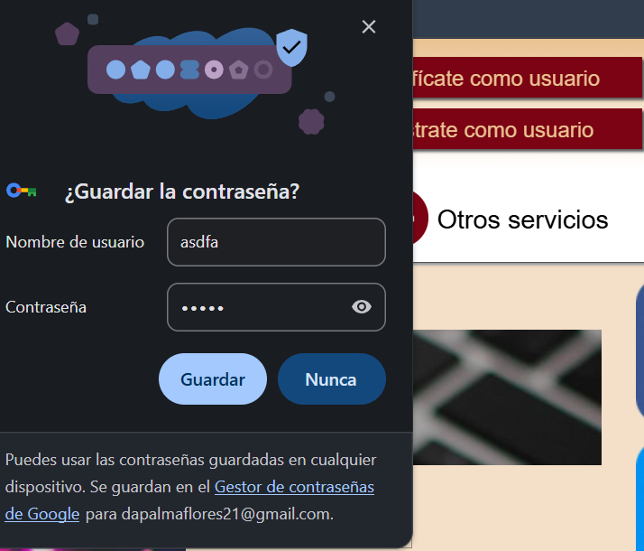
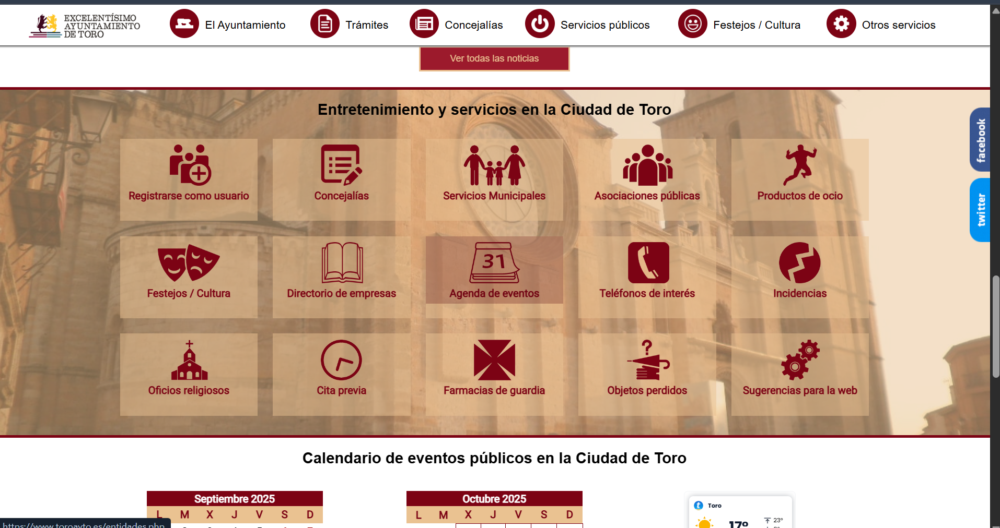
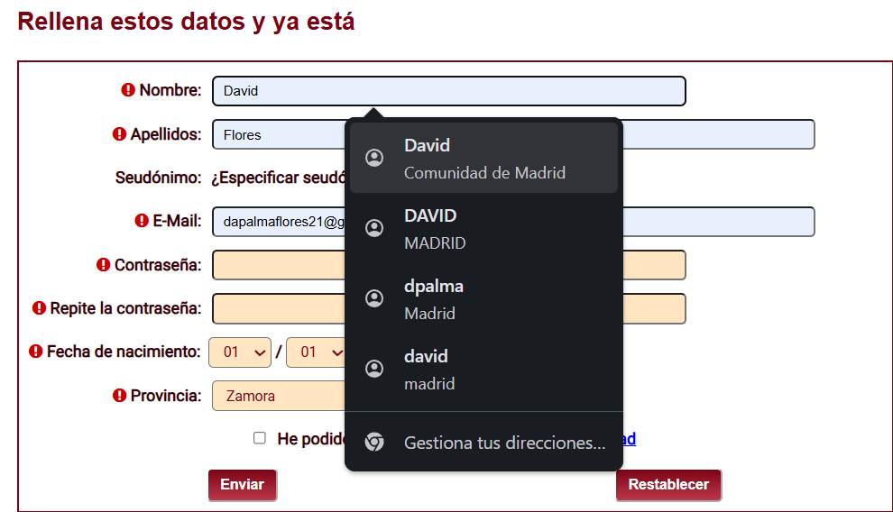
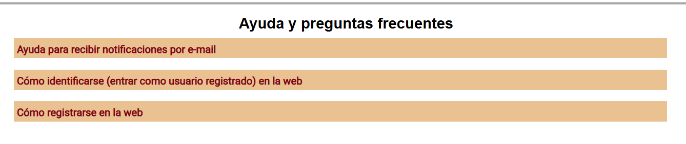

# Análisis Heurístico de Usabilidad

## 1. Visibilidad del estado del sistema
#### Interfaz de Login Analizada

se ve claramente que la visibilidad del sistema no cumple con los requisitos minimo, en cuanto a tamaño 

## 2. Coincidencia entre el sistema y el mundo real
#### Boton o interfaz en medio de la pagina web

no cumple con un ordena de la información que tenga sentido para el usuario.

## 3. Dale al usuario el control y la libertad

si cumple con darle la libertad al usuario de realizar las acciones que el desee

## 4. Consistencia y estándares

no cumple con la consistencia de estandares porque añade un icono de apagar en el apartado de servicios públicos

## 5. Prevención de errores

no cumple con la identificacion de los formularios porque te deja identificarte antes de registrarte como usuario

## 6. Reconocer en lugar de recordar

existe demasiada informacion para que el usuario pueda reconocer con facilidad algunos de los apartados entonces ya no esta cumpliendo con la sexta regla heuristica

## 7. Flexibilidad y eficiencia de uso

cumple con ciertas eficiencias en reglas repetivas de formularios como el autocompletado pero no se adapta a la personalizacion avanzada para usuarios "pro"

## 8. Estética y diseño minimalista

no se ve que tenga un diseño minimalista y legible, ya que la estetica de la pagina web tiene un diseño poco moderno

## 9. Ayuda al usuario a reconocer, diagnosticar y recuperarse de los errores

Existe el apartado de ayuda pero no es facil de reconocers y solamente te salen como hacer ciertas tareas

## 10. Ayuda y documentación

si hay apartado de ayuda
