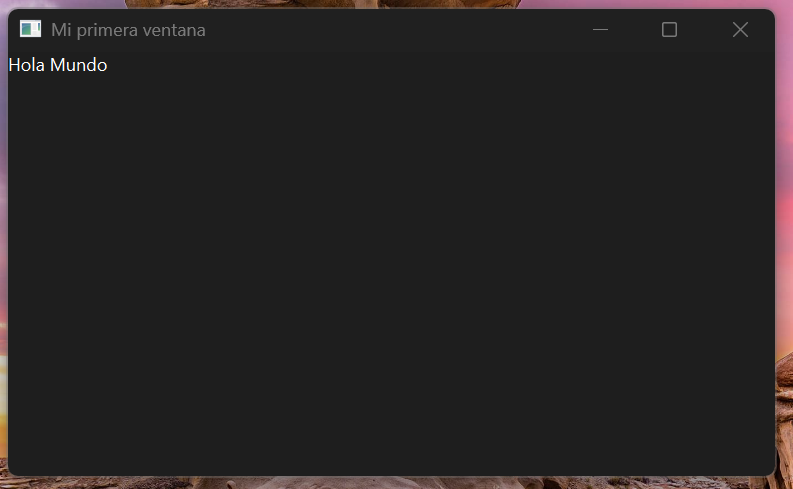

* [1. Mi primer hola mundo con PySdie6](#mi-primer-hola-mundo-con-pysdie6)
* [2. Objetivo de aprendiza](#2-objetivo-de-aprendiza)
* [3. Requisitos previos](#3-requisitos-previos)
* [4. Creación y activacion del entorno virtual](#4-creación-y-activacion-del-entorno-virtual)
* [5. Instalación de dependencias](#5-instalación-de-dependencias)
* [6. Estructura mínima de carpetas y archivos](#6-estructura-mínima-de-carpetas-y-archivos)
* [7. Código fuente(explicacion línea a línea)](#7-código-fuenteexplicacion-línea-a-línea)
* [8. Ejecución y prueba](#8-ejecución-y-prueba)
* [9. Problemas frecuentes y cómo resolverlos](#9-problemas-frecuentes-y-cómo-resolverlos)


# 1. Mi primer hola mundo con PySdie6

- Vamos a crear una ventana que tenga "hola mundo" con PySide6

- Github: https://github.com/palmasd/Desarrollo-de-Interfaces/tree/main

# 2. Objetivo de aprendiza

- Crear un entorno virtual, instalar dependencias y usar la libreria de Pyside6 para crear una ventana simple en el cual obtengamos un simple "hola mundo".
Usaremos una clase ventana y desde el main llamaremos a la ventana.

# 3. Requisitos previos

- Versión de Python utilizada (Python 3.13.7)
- Sistema Opertativo(Windows)
- Herramientas: Github, VS Code, Readme.md, Python

# 4. Creación y activacion del entorno virtual

- Comandos para crear un Entorno virtual: python -m venv venv
- Comandos para activar el entorno virtual: venv\Scripts\activate
- Comandos para desactivar el entorno virtual: deactivate
- Comando para verificar version de python: python --version

# 5. Instalación de dependencias

- Para instalar PySide6 usamos el comando: pip install PySide6
- Comando para crear un txt en donde se guarden las dependencias: pip freeze > requirements.txt
- PySide6 pertenece a la libreria de QT de Widgets la cual es principalmente utilizada para crear interfaces de usuarios, pueden mostrar informacion de estado, recibir entradas del usuario y proporcionar un contenedor para otros widgets que deben agruparse

# 6. Estructura mínima de carpetas y archivos 

proyecto-VentanaQT/
 ├─ venv
 ├─ src/
 │  ├─ main.py          # punto de entrada
 │  └─ ventana.py       # clase Ventana
 ├─ .gitignore
 ├─ requirements.txt
 └─ README.md

 - Separamos la logica en la cual la clase ventana se va a encargar de introducir los datos de la ventana y la clase main se encarga de generar el arranque de la ventana

 # 7. Código fuente(explicacion línea a línea)

 - ventana.py: define una clase Ventana que hereda de QWidget o QMainWindow, configura el título y muestra un QLabel con “Hola Mundo”. Aclara qué es un widget y cómo se añade a la ventana.
 - main.py: crea la QApplication, instancia Ventana, la muestra con .show() y arranca el bucle de eventos con app.exec().

  ```python
 app = QApplication([]) #crea una instancia de QApplication
 ventana1 = Ventana() #crea una instancia de la clase Ventana
 ventana1.show() 3muestra la ventana
 app.exec() #arranca el bucle de eventos

```

sin este bucle de eventos el script se ejecutaria de principio a fin en unos segundos y la ventana apareceria y desapareceria muy rapido que no se veria


# 8. Ejecución y prueba

- comandos para ejecutar: Ctrl + ñ para abrir la terminal y una vez dentro del proyecto ejecutar el comando "python main.py"
- se tiene que ver algo como esto 

# 9. Problemas frecuentes y cómo resolverlos

- No tuve problemas porque seguí la guia en clase 